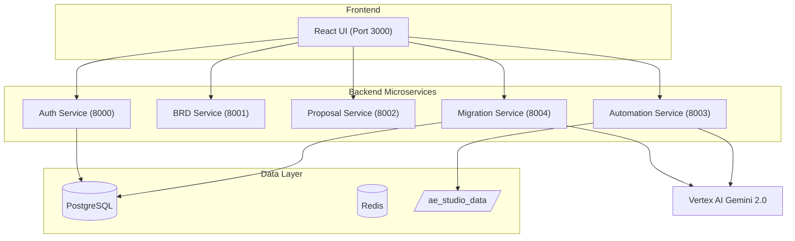

# Edge Assistant (AI-Powered RPA Migration & Automation Platform)

Edge Assistant is a production-grade, microservice-based platform designed to accelerate enterprise automation by migrating legacy RPA workflows (UiPath, Blue Prism, Automation Anywhere) to **AutomationEdge** using Generative AI (Vertex AI).


## 🚀 Key Features

- **RPA Migration Studio (Port 8004)**:
    - Port legacy workflows from **UiPath**, **Blue Prism**, and **Automation Anywhere**.
    - **Vision AI Support**: Process and analyze screenshots of legacy bots.
    - **Intelligent Chunking**: Handle massive workflow files (>50MB) with recursive AI analysis.
    - **SHA256 Cache**: Instant response for identical workflows using PostgreSQL hashing.
- **AI Automation Studio (Port 8003)**:
    - Generate functional RPA Python scripts and deployment dialogs using natural language.
    - Real-time syntax highlighting for all generated code blocks.
- **Document & Proposal Engine (Ports 8001/8002)**:
    - Generate comprehensive BRDs and sales proposals based on project descriptions.
- **Secure Architecture**:
    - Centralized JWT authentication (`auth_service` on Port 8000).
    - Role-based Access Control (AE, BA, Sales, Admin).

---

## 🏗️ Architecture



---

## 📦 Prerequisites

- **Docker & Docker Compose**
- **Google Cloud Platform**: A valid Project ID and `vertex-key.json` within the `backend/` directory.
- **Node.js 20+** (only for manual development)
- **Python 3.11+** (only for manual development)

---

## ⚡ Quick Start (Docker - Recommended)

1. **Configure Environment**:
   ```bash
   cp .env.docker.example .env
   # Edit .env with your specific Project ID and Secret Keys
   ```

2. **Verify Credentials**:
   Place your GCP service account key at `backend/vertex-key.json`.

3. **Deploy with Compose**:
   ```bash
   docker-compose up --build -d
   ```
   - **Frontend**: http://localhost:3000
   - **Microservices**: Accessible on ports 8000-8004

---

## 🛠️ Service Map

| Service | Port | Description |
| :--- | :--- | :--- |
| **Frontend** | 3000 | React UI (Nginx Alpine) |
| **Auth** | 8000 | JWT & Role Management |
| **BRD** | 8001 | Business Requirement Generation |
| **Proposal** | 8002 | Automated Sales Proposals |
| **Automation** | 8003 | AI Studio - Script & Dialog Generation |
| **Migration** | 8004 | RPA Workflow Translation (UiPath/BP/AA) |
| **Postgres** | 5432 | User data & Cache storage |
| **Redis** | 6379 | Rate limiting & caching engine |

---

## 📂 Project Structure

```bash
├── backend/
│   ├── auth_service/       # JWT Auth logic
│   ├── automation_service/ # AI Studio Core
│   ├── migration_service/  # RPA Transformer
│   ├── core/               # Shared DB & Security deps
│   ├── Dockerfile          # Multi-stage Python Slim build
│   └── requirements.txt    # Shared dependencies
├── frontend/
│   ├── src/
│   │   ├── components/     # UI & Chat Logic
│   │   ├── context/        # Auth context
│   ├── Dockerfile          # Build + Nginx Alpine stage
│   └── public/             # Assets (ae-icon.png)
└── ae_studio_data/         # Persistent production storage
```

---

## 🔒 Security Best Practices

- Always run behind an SSL-enabled reverse proxy for production.
- Use the non-root `appuser` provided in the backend `Dockerfile`.
- Ensure `SECRET_KEY` in `.env` is rotated regularly.
- Rate limits are active on all public endpoints via `FastAPILimiter`.

---

© 2026 Edge Assistant. Powered by **Vertex AI** and **AutomationEdge**.
